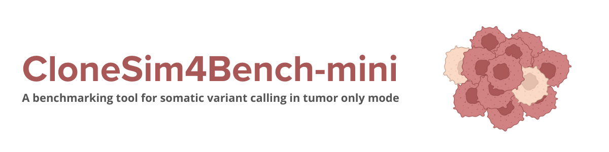
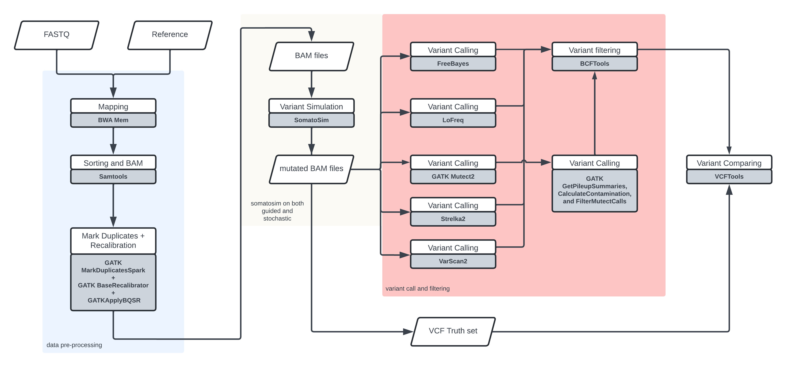

</img>

## Description

**CloneSim4Bench-mini** is a comprehensive framework designed to benchmark
variant callers for somatic variant detection in tumor-only mode, with a
particular emphasis on whole exome sequencing (WES) and clonal
hematopoiesis (CH). These areas remain relatively underexplored, as most
somatic variant research focuses on whole genome sequencing (WGS) and
tumor vs. normal comparisons.

This project aims to evaluate the performance of both stochastic and
guided simulations of somatic variants at low allele frequencies in WES,
exploring how these simulated variants affect the detection results
across different variant callers. The evaluation follows the guidelines
established by the Association for Molecular Pathology, the Association
for Pathology Informatics, and the College of American Pathologists.

Clonal hematopoiesis presents a unique challenge in somatic variant
detection, as non-normal samples can be obtained from peripheral blood.
Over time, the variant allele frequency tends to increase, typically
ranging between 0.02 and 0.20. This age-related progression makes CH a
key focus for understanding its impact on blood composition and the
detection of somatic variants in clinical settings.

## Features

-   **Optimized for Local Platforms**: Designed to efficiently run on
    portable computing environments.
-   **Simulate a Wide Range of Allele Frequencies**: Supports simulation
    of somatic variants across a broad spectrum of allele frequencie,
    closely mimicking real-world conditions.
-   **Customizable Variant Callers**: Allows users to replace or
    re-parametrize variant callers to test their performance under
    different conditions.
-   **Stochastic and Guided Simulations**: Provides both random
    (stochastic) and controlled (guided) simulations of somatic variants
    to evaluate the impact of different mutation models.
-   **Variant Detection Evaluation**: Benchmarks somatic variant
    detection accuracy (sensitivity, precision, recall) under various
    conditions, including low-frequency variants.
-   **Support for Clonal Hematopoiesis Studies**: Specially tailored for
    the study of clonal hematopoiesis, focusing on peripheral blood
    samples with low-frequency somatic mutations.
-   **Cross-Caller Comparison**: Compares the performance of multiple
    variant callers (e.g., Mutect2, FreeBayes, LoFreq) on the same
    simulated datasets for unbiased evaluation.

## Installation and Dependencies

For a detailed guide on setting up the environment and installing
necessary dependencies, please refer to the [Getting
Started](docs/Getting_Started.md) section.

To obtain the main scripts, clone the repository using Git:

```bash
git clone https://github.com/alex-arita/CloneSim4Bench
cd CloneSim4Bench
./main -i <input_dir> -o <project_dir> -r <reference> -v <vcf_file> -b <bed_file>
```

## Workflow



## Contributors

This framework was developed by Alex Fernando Arita as part of an
in-silico study for the Biomedicine course at the Universitat de
València. For inquiries, please contact arita@alumni.uv.es
